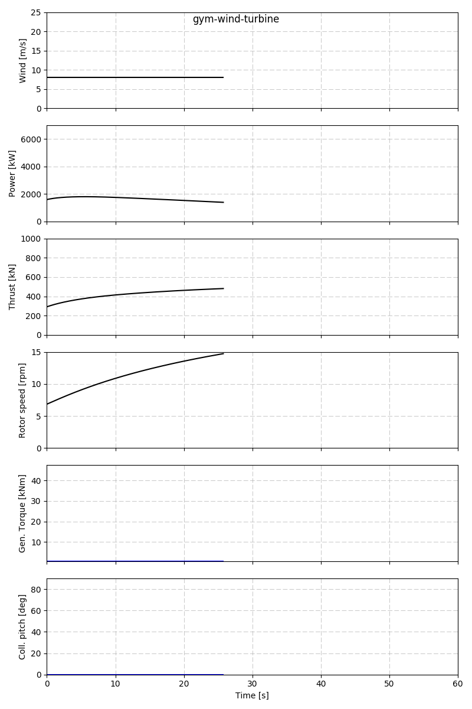
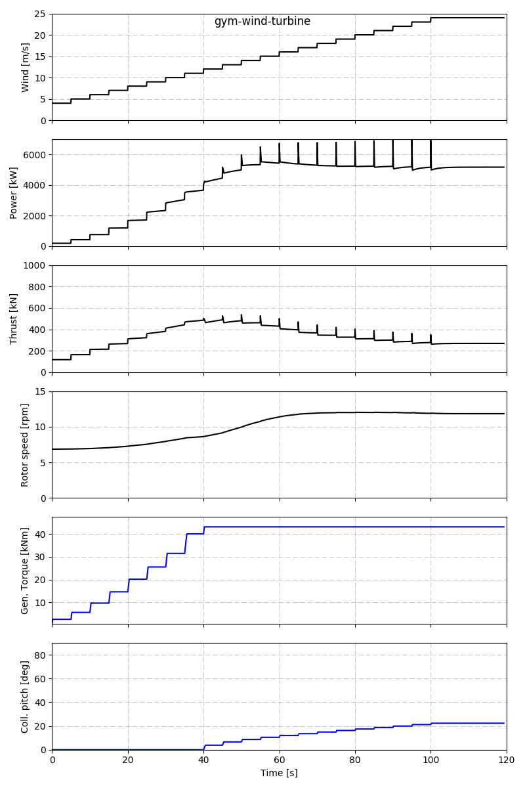

# gym-wind-turbine
OpenAI Gym environment which reproduces the behaviour of a wind turbine realistically using CCBlade aeroelastic code

## Introduction
The _gym-wind-turbine_ is a [OpenAI Gym](https://gym.openai.com/) environment which reproduces the behaviour of a wind turbine realistically. Behind the  scenes, the environment interfaces with the aerolastic code called [CCBlade](https://github.com/WISDEM/CCBlade)
 in order to compute the aerodynamic forces. Then, a simplified model of the drivetrain is added so that a driver can be implemented. The aim is to create a controller using reinforcement learning algorithms which can maximise the energy produced (power) and minimise the unwanted forces (thrust). The progress of the learning process can be also monitored by plotting metrics in real time.
 
 Here is an example of the real control in action which can be used as a reference.
 
 [Plots](https://vimeo.com/212414445)
 
### Context
 
 CCBlade<sup>[1](#ref1)</sup> performs accurate and fast aerodynamic analysis using Blade Element Momentum Theory ([BEMT](http://wisdem.github.io/CCBlade/theory.html)). The code used the NREL 5-MW Reference Wind Turbine model<sup>[3](#ref3)</sup> for its tests and I found very appropriate to use the same in the gym environment. I highly recommend to read the document as it contains a description of the real control (conventional variable-speed, variable blade-pitch-to-feather configuration) and its source code. If that is too dense, I'll try to explain it as a statistician (like me) would do in pub having some drinks.

The individual control of a wind turbine can perform 2 main actions, increase (decrease) the generator torque and increase (decrease) the blade pitch.
 
Generator torque can be seen as the force required to move the generator shaft. If the value is too low for a given wind speed, the blades will spin fast as the generator is not opposing resistance. If to the contrary, the value is too high for a given wind speed, the blades will barely move as the wind does not have enough power to overcome the resistance imposed by the generator. In both cases the energy produced will be very low. As you can see, the generator torque acts as a "break" which regulates the speed of the blades spinning (rotor speed). So the main question here is _what torque should be applied so that the blades rotate at the optimal speed which generates the maximum energy given the current wind?_ That's the job of the learning algorithm! 
 
The good news is that exists an optimal rotor speed which captures the maximum power given the wind speed and the aerodynamic configuration. The curve is usually plotted as C<sub>p</sub> vs Tip Speed Ratio and the real control has those optimal values "hard-coded" ([more details](http://www.nrel.gov/docs/fy04osti/36265.pdf))

But what happens if the wind is so strong that the generator torque is not able to "deal" with it? Then the pitch control comes into action. The pitch is the angle of the blades. Assume the wind comes perpendicular to the virtual disc formed by the blades. If the pitch is 0 degrees, the widest section of the blade (chord) is facing to the wind and the maximum power is captured. If instead, the pitch is 90 degrees, the narrowest section of the blade is facing to the wind like the wings of a plane. Thus, the pitch helps to regulate how much power you want to capture from the wind. If it is too strong for your generator or structure, increasing the pitch angle will let the air go through the blades by offering less resistance (thrust).

That is basically it, the control should use generator torque and pitch angle to get the maximum power from the wind while not exceeding other operational constrains. Remember that I tried to find a balance between a simple but yet realistic environment so that the results obtained could be an approximation of the results expected from more extensive aerolastic codes such as [FAST](https://nwtc.nrel.gov/FAST).

For those unfamiliar with OpenAI Gym environments, there is excellent [documentation](https://gym.openai.com/docs) in their site. The basic concepts of environments will be introduced in the first case of the Run examples section.

## Getting started
### Installation
The package has been coded and tested on GNU/Linux and Windows environments with Python 2.7 and 3.6.

#### Ubuntu 16.04.3
It requires Python 2.7 or 3.6 and the Fortran compiler for the CCBlade routines.
```
$ sudo apt install python-pip python-dev python-virtualenv python-tk gfortran
$ virtualenv gwt-devenv
$ source gwt-devenv/bin/activate
(gwt-devenv)$ pip install numpy==1.12.1
(gwt-devenv)$ pip install -r requirements.txt
```
Numpy is installed first as it contains the distutils that are able to compile Fortran code at installation time. Ensure all the pieces are working correctly:
```
(gwt-devenv)$ ccblade
(gwt-devenv)$ gwt-run-neutral
```

#### Windows 10
##### Python 2.7
- [Anaconda2 4.4.0](https://repo.continuum.io/archive/Anaconda2-4.4.0-Windows-x86_64.exe)
- [Microsoft Visual C++ Compiler for Python 2.7](http://aka.ms/vcpython27)

##### Python 3.6
- [Anaconda3 4.4.0](https://repo.continuum.io/archive/Anaconda3-4.4.0-Windows-x86_64.exe)
- [Microsoft Visual C++ 2015 Build Tools](http://landinghub.visualstudio.com/visual-cpp-build-tools)

Once both are installed, proceed with an Anaconda Prompt
```prompt
(Anaconda)> conda create --name gwt-devenv python=3.6.2 scipy=0.18.1 zope.interface=4.4.2 m2w64-gcc-fortran=5.3.0
(Anaconda)> activate gwt-devenv
(gwt-devenv)> pip install -r requirements.txt
```
Test your installation with:
```prompt
(gwt-devenv)> ccblade
(gwt-devenv)> gwt-run-neutral
```

#### Other platforms
The code will probably work on a macOS systems too, I suggest to follow a similar approach explain in Windows section which uses Anaconda.
A Dockerfile is also provided. The rendering should be fine as saving the plots into files is now set by default. Note that the animated rendering will not work out of the box. It will probably require linking the docker instance into a X server.
Here are the instructions:
```bash
docker build -t gym-wind-turbine:1.0.0 .
docker run gym-wind-turbine:1.0.0
```
For exploring inside the image:
```bash
docker run -it --entrypoint /bin/bash  gym-wind-turbine:1.0.0
```

### Docker notes
```
docker build -t gym-wind-turbine:latest .
docker run -v C:\Users\emerrf\Documents\GitHub\remote\gym-wind-turbine\docker_gwt_output:/app/gym-wind-turbine/gwt_output gym-wind-turbine:latest 
```

### Run samples
The `gym_wind_turbine/envs/wind_turbine_run.py` file contains sample code of how to use the environment. There are several cases and each one has a command line entry point associated.  

#### Case: neutral action
Command line:
```bash
(gwt-devenv)$ gwt-run-neutral
```
Code:
```python
def run_neutral_actions():

    wt = gym.make('WindTurbine-v0')

    # Discovering action and observation spaces
    print(wt.action_space)
    print(wt.observation_space)
    print(wt.action_space.sample())

    print("Episode using neutral action")
    observation, _, done, _ = wt.reset()
    action = wt.env.neutral_action
    while not done:
        observation, reward, done, info = wt.step(action)

    wt.render()
```
The code is self explanatory but I'll quickly go through for the newcomers. The `WindTurbine-v0` environment is instantiated in `wt` variable. This is the simplest one and it simulates constant wind at 8 m/s. 
```bash
>>> wt = gym.make('WindTurbine-v0')
[2017-07-13 08:34:55,421] Making new env: WindTurbine-v0
[2017-07-13 08:34:55,421] {'duration': 60.0, 'timestep': 0.05, 'wind': {'speed': 8.0, 'mode': 'constant'}}
```

Before starting the simulation, let's explore the metrics we will be working with. Each observation of the environment is composed by 6 measurements which are detailed next:

Index | Name and units | Min | Max  
------|----------------|-----|----
0 | Wind speed [m/s]       | 3     | 25
1 | Power generated [kW]   | 0     | 7000
2 | Thrust [kN]            | 0     | 1000 
3 | Rotor speed [rpm]      | 0     | 15
4 | Generator torque [kN·m] | 0.606 | 47.403
5 | Collective pitch [deg] | 0     | 90

There is also the action space which specifies what actions are available and their allowed value range. As the control will be in charge of the generator torque and the collective pitch, the actions allowed are their change rate.

Index | Name and units | Min | Max  
------|----------------|-----|----
0 | Generator torque rate [kN·m/s] | -15.0 * dt | 15.0 * dt
1 | Collective pitch rate [deg/s] | -8.0 * dt | 8.0 * dt

The specifications of the wind turbine defines the maximum change rate per second. However, as the simulation is computed every 1/20 seconds, the maximum range allowed at the decision time is also 1/20th of the maximum value (dt = 0.05). 

The following code block runs the simulation:
```python
    observation, _, done, _ = wt.reset()
    action = wt.env.neutral_action
    while not done:
        observation, reward, done, info = wt.step(action)
```
The `wt.reset()` statement restarts the environment to the initial values and executes the first step which returns the first observation. The `done` variable contains a boolean that indicates whether the simulation is over or not. The simulation terminates when any of the metrics reaches its limits as the wind turbine is expected to operate inside those. Reaching a limit means that the wind turbine structure could break or the generator ignite. In such case, the `done` variable will be set to `True` and the episode should end. Then, the environment must be reset in order to begin the next episode. While the environment is not done, the RL algorithm should decide what to do. 

Suppose that a dumb algorithm was used and it just decides to do nothing at every time step. This is the same as using the neutral action (`wt.env.neutral_action`) which has 0.0 for the both generator torque and pitch change rates. In such scenario the simulation plots will look like as follows:



The control variables (generator torque and coll. pitch lines in blue) do not change. The wind speed at 8 m/s makes the rotor speed increase as the aerodynamic torque is higher than the torque imposed by the generator. Given the generator torque and pitch the rotor would stabilise at around 21 RPMs. However, as the 15 RPM limit is reached the episode terminates. Note how the Thrust gradually incremented a long with a Power decrement showing that the wind turbine is running with suboptimal settings. There is an optimal rotor speed which the wind turbine generates the maximum Power at wind speed of 8 m/s. The optimal RPMs are 9 RPMs approximately and those can be achieved by setting the generator torque to 20.147 kN·m with coll. pitch of 0 degrees. That is what the RL algorithm should find by setting different change rates at each time step. 

The algorithm can use the `reward` variable as a measurement of how good the previous decision or taken action was. The default reward function is a linear combination of the Power (80%) and the Thrust (20%) generated with a range of [-200, 5600].
  
The statement `wt.render()` is set to generate and save a simulation plot containing the metrics values recorded during the episode. The output shows the relative path to the file. 
```bash
[2017-07-13 09:00:27,059] Saving figure: gwt_render_output_20170713090013\ep_00001_149992922673.png
```
There is an animation mode that can be enabled using `wt.env.activate_render_animation()` which will plot the the metrics at real time. Checkout `wind_turbine_run.run_neutral_actions_with_animation` function.

If no limits are reached, the environment will terminate after 60 seconds of simulated time (2400 time steps).
 
 #### Case: real control
 
 TODO


### Motivation

I created this environment for learning purposes, from one side it satisfies my curiosity in understanding how wind turbines work and how they are controlled and also my interest in learning AI techniques. I thought that opening this challenge to the AI community could bring interesting results, and who knows if we can eventually improve existing drivers with them.  

###  Acknowledgments

Special thanks to @andrewning for creating the CCBlade code and the NREL Wind team in general for opening their work to the community. Also thanks to the OpenAI for starting the Gym initiative and contributing to democratise the AI. Thanks to @cvillescas for supporting and helping me to understand the theory. 

### References

<a name="ref1">[1]</a>: S. Andrew Ning. A simple solution method for the blade element momentum equations with guaranteed convergence. Wind Energy, June 2013. doi:10.1002/we.1636.

<a name="ref2">[2]</a>: Greg Brockman, Vicki Cheung, Ludwig Pettersson, Jonas Schneider, John Schulman, Jie Tang, Wojciech Zaremba. OpenAI Gym. June 2016. arXiv:1606.01540.

<a name="ref3">[3]</a>: J. Jonkman, S. Butterfield, W. Musial, and G. Scott. [Definition of a 5-MW Reference
Wind Turbine for Offshore System Development](http://www.nrel.gov/docs/fy09osti/38060.pdf), February 2009

<a name="ref4">[4]</a>: Kathryn E. Johnson. [Adaptive Torque Control of Variable Speed Wind Turbines](http://www.nrel.gov/docs/fy04osti/36265.pdf), August 2004